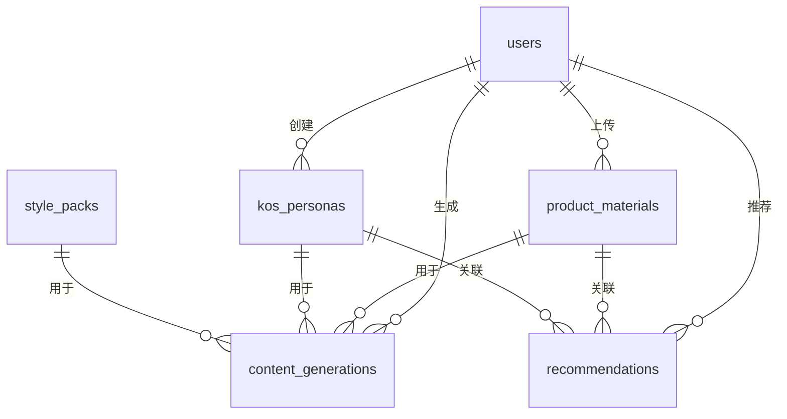

# Personalize 2.0 数据库表设计

## 1. 用户表 (users)
| 字段名 | 类型 | 描述 | 约束 |
|-------|------|------|------|
| id | UUID | 用户唯一标识 | 主键，默认生成 |
| email | VARCHAR(255) | 邮箱 | 唯一，非空 |
| password_hash | VARCHAR(255) | 密码哈希 | 非空 |
| username | VARCHAR(100) | 用户名 | 唯一 |
| subscription_plan | ENUM('free', 'pro', 'business') | 订阅套餐 | 默认 'free' |
| subscription_start | TIMESTAMP | 订阅开始时间 |  |
| subscription_end | TIMESTAMP | 订阅结束时间 |  |
| created_at | TIMESTAMP | 创建时间 | 默认 CURRENT_TIMESTAMP |
| updated_at | TIMESTAMP | 更新时间 | 默认 CURRENT_TIMESTAMP ON UPDATE CURRENT_TIMESTAMP |

## 2. 产品素材表 (product_materials)
| 字段名 | 类型 | 描述 | 约束 |
|-------|------|------|------|
| id | UUID | 素材唯一标识 | 主键，默认生成 |
| user_id | UUID | 所属用户ID | 外键 (users.id) |
| material_type | ENUM('document', 'image') | 素材类型 | 非空 |
| file_path | VARCHAR(500) | 文件存储路径 | 非空 |
| file_name | VARCHAR(255) | 原始文件名 | 非空 |
| file_size | BIGINT | 文件大小 (字节) | 非空 |
| mime_type | VARCHAR(100) | 文件MIME类型 | 非空 |
| parsed_content | JSON | 解析后的结构化内容 |  |
| is_parsed | BOOLEAN | 是否已解析 | 默认 false |
| parsed_at | TIMESTAMP | 解析时间 |  |
| created_at | TIMESTAMP | 创建时间 | 默认 CURRENT_TIMESTAMP |

## 3. KOS人设表 (kos_personas)
| 字段名 | 类型 | 描述 | 约束 |
|-------|------|------|------|
| id | UUID | 人设唯一标识 | 主键，默认生成 |
| user_id | UUID | 所属用户ID | 外键 (users.id) |
| name | VARCHAR(100) | 人设名称 | 非空 |
| avatar_url | VARCHAR(500) | 头像URL |  |
| domain_tags | JSON | 领域标签 | 非空，默认 [] |
| professional_background | JSON | 专业背景 |  |
| expression_style | JSON | 表达风格 | 非空 |
| audience_relation | JSON | 受众关系 |  |
| professional_preferences | JSON | 专业偏好 |  |
| is_template | BOOLEAN | 是否为模板 | 默认 false |
| template_category | VARCHAR(100) | 模板类别 (如美妆、科技等) |  |
| created_at | TIMESTAMP | 创建时间 | 默认 CURRENT_TIMESTAMP |
| updated_at | TIMESTAMP | 更新时间 | 默认 CURRENT_TIMESTAMP ON UPDATE CURRENT_TIMESTAMP |

## 4. 内容生成记录表 (content_generations)
| 字段名 | 类型 | 描述 | 约束 |
|-------|------|------|------|
| id | UUID | 生成记录唯一标识 | 主键，默认生成 |
| user_id | UUID | 所属用户ID | 外键 (users.id) |
| product_material_id | UUID | 关联产品素材ID | 外键 (product_materials.id) |
| kos_persona_id | UUID | 关联KOS人设ID | 外键 (kos_personas.id) |
| style_pack_id | UUID | 关联风格包ID | 外键 (style_packs.id) |
| platforms | JSON | 生成平台列表 | 非空 |
| content_pack | JSON | 生成的内容包 | 非空 |
| status | ENUM('pending', 'success', 'failed') | 生成状态 | 默认 'pending' |
| created_at | TIMESTAMP | 创建时间 | 默认 CURRENT_TIMESTAMP |
| completed_at | TIMESTAMP | 完成时间 |  |

## 5. 风格包表 (style_packs)
| 字段名 | 类型 | 描述 | 约束 |
|-------|------|------|------|
| id | UUID | 风格包唯一标识 | 主键，默认生成 |
| name | VARCHAR(100) | 风格包名称 | 非空 |
| category | VARCHAR(100) | 风格类别 | 非空 |
| image_styles | JSON | 图片处理样式 | 非空 |
| tone | VARCHAR(100) | 文案语气 | 非空 |
| layout_reference | VARCHAR(500) | 版式参考 |  |
| recommended_tags | JSON | 推荐Tag | 非空，默认 [] |
| is_builtin | BOOLEAN | 是否为内置 | 默认 true |
| created_at | TIMESTAMP | 创建时间 | 默认 CURRENT_TIMESTAMP |

## 6. 推荐发布计划表 (recommendations)
| 字段名 | 类型 | 描述 | 约束 |
|-------|------|------|------|
| id | UUID | 推荐唯一标识 | 主键，默认生成 |
| user_id | UUID | 所属用户ID | 外键 (users.id) |
| news_title | VARCHAR(500) | 新闻标题 | 非空 |
| news_source | VARCHAR(200) | 新闻来源 | 非空 |
| news_url | VARCHAR(500) | 新闻URL | 非空 |
| hot_keywords | JSON | 热点关键词 | 非空，默认 [] |
| recommended_product_id | UUID | 推荐关联产品ID | 外键 (product_materials.id) |
| recommended_persona_id | UUID | 推荐关联人设ID | 外键 (kos_personas.id) |
| recommended_platforms | JSON | 推荐发布平台 | 非空，默认 [] |
| best_publish_time | TIMESTAMP | 最佳发布时间 | 非空 |
| relevance_score | DECIMAL(3,2) | 关联度评分 (0-1) | 非空 |
| content_preview | JSON | 内容预览 |  |
| is_used | BOOLEAN | 是否已使用 | 默认 false |
| created_at | TIMESTAMP | 创建时间 | 默认 CURRENT_TIMESTAMP |

## 表关系图

