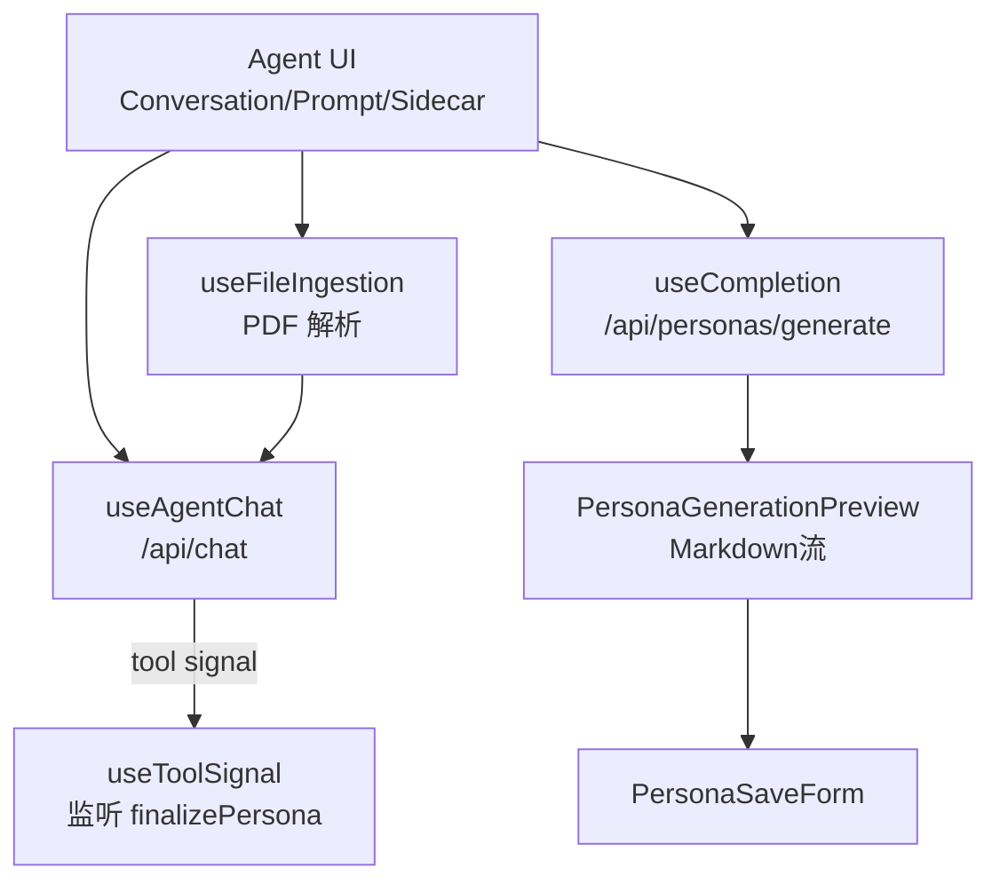

# Persona Agent 最佳实践（前后端 + UI）

面向初学者的落地指南，教你如何用项目里的 Agent Kit（`modules/agent/*`）快速搭建「人设 / Persona」类的 AI 体验。涵盖前端编排、后台接口、工具监听、文件上传以及工具/选择题渲染。

## 总览与核心角色
- **适配层（Adapter）**：`modules/agent/adapters/persona.ts` 提供工具名、关键词、PDF 标记常量、payload 构造、结果解析。
- **通用 UI**：`modules/agent/ui/*` 提供聊天、侧栏、工具卡、选择题卡、Prompt 输入等。
- **通用 Hooks**：`modules/agent/hooks/*` 负责聊天、文件导入、工具监听、Pane 状态等。
- **后端接口**：`/api/chat`（对话流）与 `/api/personas/generate`（流式生成结果）。确保后端工具名与 `PERSONA_TOOL_NAME` 对齐。



## 前端：最小接入步骤
1) **引入适配常量与 UI**  
   ```tsx
   import {
     PERSONA_TOOL_NAME,
     PERSONA_PDF_MARKER,
     PERSONA_GENERATE_KEYWORDS,
     buildPersonaPayload,
     parsePersonaResult,
   } from "@/modules/agent/adapters/persona";
   import { AgentConversation } from "@/modules/agent/ui/agent-conversation";
   import { AgentPromptInput } from "@/modules/agent/ui/agent-prompt-input";
   import { ToolCallCard } from "@/modules/agent/ui/tool-call-card";
   import { SelectionQuestionCard } from "@/modules/agent/ui/selection-question-card";
   ```

2) **聊天与生成 Hook**  
   ```tsx
   const { messages, sendMessage, status, error } = useAgentChat({ api: "/api/chat", model: "..." });
   const { completion, complete, stop, isLoading, setCompletion } = useCompletion({
     api: "/api/personas/generate",
     onFinish: (_prompt, text) => setFinalPersona(parsePersonaResult(text ?? "")),
   });
   ```

3) **监听工具触发自动生成**  
   ```tsx
   useToolSignal({
     messages,
     toolName: PERSONA_TOOL_NAME,
     onMatch: () => complete("", { body: buildPersonaPayload(messages) }),
   });
   ```

4) **文件上传（PDF）**  
   - 用 `useFileIngestion` + 业务 parser（本项目为 `parsePdfToText`）。  
   - 发送到对话时，使用 `PERSONA_PDF_MARKER` 前缀，adapter 会自动识别。  
   ```tsx
   const { ingest, uploading } = useFileIngestion({ parser: parsePdfToText, acceptTypes: ["application/pdf"] });
   const text = await ingest(file);
   await sendMessage({ parts: [{ type: "text", text: `${PERSONA_PDF_MARKER}\n\n${text}` }] });
   ```

5) **聊天区渲染（工具 + 选择题）**  
   - `AgentConversation` 接收 `renderers` 与 `toolRenderer`。  
   - 选择题：对 text part 先 `extractSelectionQuestions`，用 `SelectionQuestionCard` 渲染。  
   - 工具：直接用 `ToolCallCard` 渲染 `ToolUIPart`。
   ```tsx
   const selectionRenderer: AgentPartRenderer = ({ part, message }) => {
     if (part.type !== "text" || !part.text) return null;
     const { cleanText, questions } = extractSelectionQuestions(part.text);
     if (!questions.length) return null;
     return (
       <div className="space-y-3">
         {cleanText && <MessageResponse>{cleanText}</MessageResponse>}
         {questions.map((q, idx) => (
           <SelectionQuestionCard key={`${message.id}-${idx}`} question={q} selectedOptions={selected} onSelect={toggle} />
         ))}
       </div>
     );
   };
   const toolRenderer = (part: ToolUIPart) => <ToolCallCard part={part} />;

   <AgentConversation messages={messages} status={status} renderers={[selectionRenderer]} toolRenderer={toolRenderer} />;
   ```

6) **Prompt 输入组件复用**  
   - 用 `AgentPromptInput` 统一管理占位、禁用、提交状态，自带 `PromptInputSubmit`。  
   - 可通过 `footerContent` 注入 “停止生成” 等按钮。

7) **预览与保存**  
   - `PersonaGenerationPreview` 读取 `completion` 的 Markdown 流。  
   - 保存时使用 `PersonaSaveForm` 或自定义表单，`parsePersonaResult`/`buildFallbackPersona` 提供可靠数据结构。

## 后端要点
- `/api/chat`：返回符合 `ai` SDK UIMessage 的流；确保工具调用名与 `PERSONA_TOOL_NAME` 一致（默认 `finalizePersona`）。
- `/api/personas/generate`：返回 Markdown 文本流。前端会调用 `parsePersonaResult` 提取结构化字段，解析失败时用 `buildFallbackPersona` 兜底。
- 工具出参/入参结构会在 `ToolCallCard` 中直接 JSON.pretty，保持可读即可。

## 监听工具 & 关键词触发
- **关键词**：`PERSONA_GENERATE_KEYWORDS` 包含「生成人设」等触发词，可在提交后检测并调用 `complete`。
- **工具信号**：`useToolSignal` 自动扫 message parts（`ToolUIPart`），按 `toolName` 去重触发，避免重复执行。

## 选择题消息格式
- 服务端返回 text 中包含 `<选择题> ... </选择题>` 块：  
  ```text
  <选择题>
    <题目>你的受众是？</题目>
    <选项>学生</选项>
    <选项>职场新人</选项>
  </选择题>
  ```
- 前端用 `extractSelectionQuestions` 解析，`SelectionQuestionCard` 渲染按钮并回写到输入框或本地状态。

## 文件上传注意事项
- `useFileIngestion` 会校验文件类型/大小（默认 10MB）。  
- 解析进度通过 `progress` 暴露，可在 UI 展示阶段/百分比。  
- 上传失败应捕获错误并重置 `<input>`，避免残留。

## 建议的目录组织
- **核心复用层**：`modules/agent`（hooks、UI、types、adapters）。  
- **业务页面**：仅负责编排、状态聚合、文案/样式；不要在页面内写工具名/魔法常量。  
- **适配器**：在 `modules/agent/adapters/<feature>.ts` 定义业务常量、payload 构造、结果解析，供前后端共享。

## 快速 Checklist
- [ ] 工具名、关键词、PDF 标记使用 `persona` adapter 导出的常量。  
- [ ] 文本消息若包含选择题，确保 `<选择题>` 结构正确。  
- [ ] 工具调用 UI 已用 `ToolCallCard`；选择题 UI 用 `SelectionQuestionCard`。  
- [ ] Prompt 输入使用 `AgentPromptInput`，并根据流状态禁用。  
- [ ] `/api/chat` 与 `/api/personas/generate` 已对齐模型/工具名。  
- [ ] PDF 上传使用 `useFileIngestion` 并处理错误/重置。
